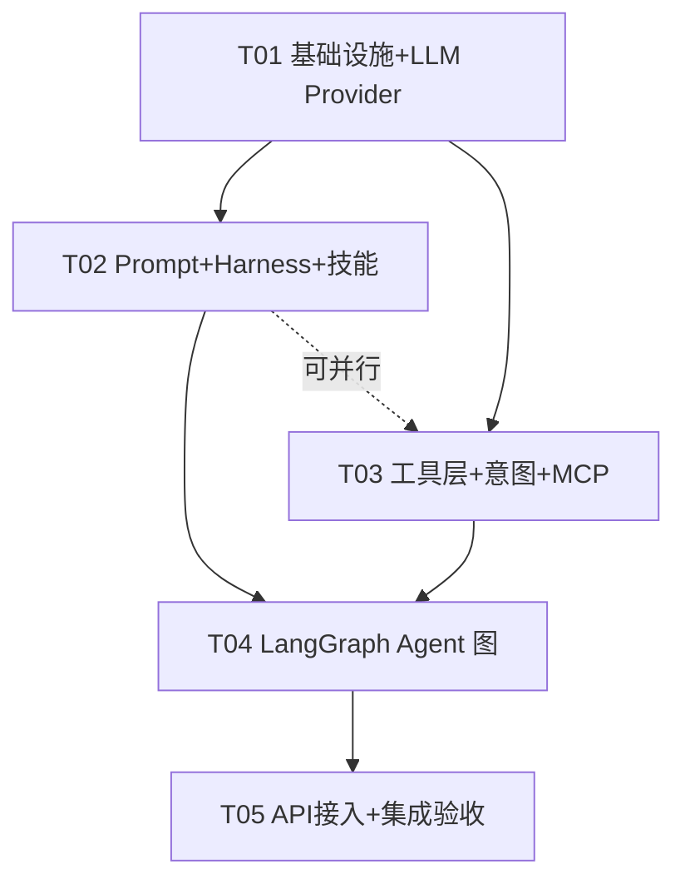
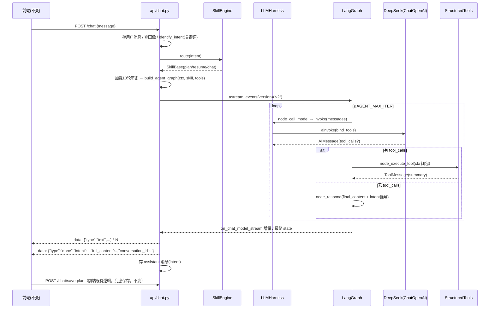

# 智途校园 — LangChain Agent 重构 · 实施任务分解

> 架构师：高见远（software-architect）
> 输入：`智途校园-LangChain-Agent-重构方案.md`（已获用户确认）+ `<项目根>` 实际代码调研
> 默认 LLM：**DeepSeek**（`deepseek-v4.1-flash`，base_url `https://api.deepseek.com/v1`，key 读 `.env` 的 `DEEPSEEK_API_KEY`）

---

## 一、设计校验与调整（最终定论）

以下每条都是"方案文档 vs 实际代码"比对后的结论，工程师按本节执行，与方案冲突处以本节为准。

### 1.1 AgentState 不放 db_session（重大调整）

**方案原文**：`AgentState` 含 `db_session: AsyncSession`。
**问题**：
- AsyncSession 不可序列化，会破坏 LangGraph 的 state 快照/检查点能力与 `add_messages` reducer 的纯函数约定；
- state 里混入请求级可变对象，多轮 tool 循环中 session 的 commit/rollback 语义会失控。

**最终定论**：**请求级依赖用「graph 工厂闭包 + ToolContext」注入，不进 state。**

```python
# agent/toolkit.py
@dataclass
class ToolContext:
    db: AsyncSession
    user_id: int

# agent/graph.py
def build_agent_graph(ctx: ToolContext, skill: SkillBase, ...) -> CompiledGraph:
    tools = [make_query_plans_tool(ctx), ...]   # 闭包绑定 db/user_id
    ...  # 编译图，ctx 只存在于闭包中
```

`AgentState` 仅保留可序列化字段：`messages / user_id / conversation_id / intent / profile_context / tool_call_count / final_content`。
（已验证可行性：现有 `chat.py` 的 `event_stream()` 生成器内在依赖注入的 db 上执行查询+commit，本项目 FastAPI 版本下可用，有先例。）

### 1.2 旧 BaseTool / ToolRegistry / skills 根模块：零改动并存（调整）

**方案原文**：`agent/tools/base.py [改造]`、`skills/base.py [改造]`、`plan_skill.py/resume_skill.py [改造迁移]`。
**问题**：`generate_plan.py / generate_resume.py` 两个旧工具 import 了 `BaseTool`、`skill_registry`、旧 `PlanSkill/ResumeSkill`。一旦原地改造基类，coze 回退路径和旧工具链全部 import 断裂，违反"一行切回 Coze"的铁律。

**最终定论**：
- `agent/tools/base.py`、`agent/tools/registry.py`、`app/skills/base.py`、`app/skills/registry.py`、`app/skills/plan_skill.py`、`app/skills/resume_skill.py`、`app/skills/__init__.py`、`generate_plan.py`、`generate_resume.py` **全部不改动、不备份（未改无需备份）**；
- 新的 LangChain 工具层放新文件 `agent/tools/toolkit.py`（ToolContext + StructuredTool 工厂 + 新注册表）；
- 新的技能插件体系放 `app/skills/skill_engine.py`（含新 SkillBase 基类），技能包放 `skills/plan/`、`skills/resume/`、`skills/chat/` 三个新目录，与旧文件并存。

### 1.3 generate_plan / generate_resume 不迁移为 LangChain 工具（重大调整，需用户确认）

**方案原文**：6 个工具全部迁移为 StructuredTool。
**问题**：旧 `GeneratePlanTool.execute()` 内部再调 `AiService.chat_json()`（嵌套 LLM 调用）。在 ReAct 图里这样做意味着：主模型 tool_call → 工具内再起一次完整 LLM 请求 → 结果回传主模型 —— 双倍 token、双倍延迟，且规划内容由内层模型生成，主模型只做转发，浪费了 tool calling 的意义。

**最终定论（推荐，默认按此实施）**：
- 只迁移 4 个**纯读工具**：`query_plans / query_resumes / query_profile / query_points`（DB 查询，无 LLM 调用）；
- **规划/简历的生成由主模型直出**：命中 `generate_plan/generate_resume` 意图时路由到对应 Skill，用该 Skill 的 system prompt（YAML）约束主模型按 JSON 结构输出 —— 与现在 Coze 的行为完全一致；
- 保存路径不变：前端拿 `done` 事件后调 `/chat/save-plan`、`/chat/save-resume`（`chat.py` 的 `_extract_*` 兜底解析函数**原样保留**）；
- 旧 `generate_plan.py / generate_resume.py` 文件保留不迁移（连同旧 BaseTool 一起构成完整回退路径）。
- ⚠️ 此条列入"待明确事项"，请用户最终确认。旧的 `should_confirm/[待确认]` confirm 流程当前 Coze 路径已不使用，本次不实现。

### 1.4 DeepSeek tool calling 兼容性（定论）

- DeepSeek 提供 OpenAI 兼容 API，`ChatOpenAI(model=..., base_url="https://api.deepseek.com/v1")` + `bind_tools()` 直接可用，无需特殊适配；
- **模型名 `deepseek-v4.1-flash` 做成配置项**（`DEEPSEEK_MODEL`），不硬编码 —— 以 DeepSeek 平台实际模型 ID 为准，装机后如 404/invalid model 改 `.env` 一行即可；
- 降级链（在 `model_config.py` 实现）：`deepseek 工具调用异常(连续N次)` → 降级为"无工具 + 关键词意图路由"模式（复用 `intent.py` 关键词通道），Qwen 作为备用 provider 保留（`QWEN_API_KEY` 配置已存在）。

### 1.5 astream_events 版本 API（定论）

- `agent.astream_events(input, version="v2")`：`langchain-core>=0.2` 全系支持，`version` 参数**必填**；
- 节点内部用 `await llm.ainvoke(...)` 即可 —— `astream_events` 会自动把底层 `on_chat_model_stream` 事件冒泡出来，**不需要**在节点里手写 astream；
- 事件过滤约定：只转发 `event["event"] == "on_chat_model_stream"` 且 `chunk.content` 非空的增量。tool 循环中间轮次模型一般只发 tool_calls 无 content，天然不会污染文本流；若中间轮偶发少量文本，直接转发（前端打字机可接受），**不要**做复杂过滤。

### 1.6 SSE 事件格式（铁律，定论）

三种事件、字段名一个字节都不能变：
- `{"type":"text","content":"..."}` —— 增量片段
- `{"type":"done","intent":"...","full_content":"..."}` —— chat.py 会注入 `conversation_id` 字段（现有行为，保留）
- `{"type":"error","message":"..."}`

`intent` 取值仍限 `generate_plan / generate_resume / chat` 三种（conversations 列表的图标映射依赖它）。

### 1.7 意图识别双通道（定论）

```
用户消息 → identify_intent(msg)   [关键词通道，chat.py 入口处，复用现有 INTENT_KEYWORDS]
              │ 命中 generate_plan/generate_resume → 路由对应 Skill（prompt + 工具集）
              │ 命中 query_* / None → 路由 chat Skill（LLM tool calling 自主决策）
done 事件 intent 推导（node_respond）：
  1) 本次运行路由的 Skill 是 plan/resume → intent = generate_plan / generate_resume
  2) 否则 → parse_intent_from_reply(full_content)  [从 coze_client._parse_intent 移植的关键词兜底]
  3) 否则 → "chat"
```

### 1.8 其余小项定论

- **pydantic 2.9.0 + langchain**：兼容，无需升级 pydantic；
- **对话历史**：现有代码 `build_context_message` 支持 history 但 chat.py 没传。本次从 `chat_messages` 按 `conversation_id` 加载最近 10 轮进 messages（前端零影响，仅提升连贯性）；
- **MCP**：`langchain-mcp-adapters` 的 `MultiServerMCPClient` API 在 0.1.x 与 0.4.x 之间有差异（构造参数 vs `connect_to_server` 方法）。**本期只建骨架**：注册表默认为空、未注册 server 时返回空工具列表、零启动开销；`db_mcp_server.py` 作为可选示例。以实际安装版本的 API 为准；
- **Windows**：MCP stdio 子进程用 `sys.executable` 启动，不要写死 `python`；
- **main.py 不改**：LLM/PromptManager/Harness 全部模块级懒加载单例，不动应用入口；
- **.env**：新增 DeepSeek 段，Coze 段保留（回退用）。注意 `.env` 中现有 Coze PAT / Qwen key 为明文，建议后续轮换（见待明确）。

---

## 二、文件清单

路径基准：`<项目根>\backend\`

### [新增] — app/llm/（LLM 管理层）

| 文件 | 职责 |
|---|---|
| `app/llm/__init__.py` | 包导出：get_llm / get_prompt_manager / get_harness |
| `app/llm/llm_provider.py` | ChatOpenAI 封装（DeepSeek OpenAI 兼容 API），懒加载单例，`get_llm()` / `get_llm_with_tools(tools)`，streaming=True |
| `app/llm/model_config.py` | 模型参数（temperature/max_tokens）+ 降级策略（deepseek 工具调用连续失败 → 关键词模式；Qwen 备用 provider 配置） |
| `app/llm/prompt_manager.py` | YAML+jinja2 模板统一管理：扫描 `app/skills/*/prompts/*.yaml`，sandbox 渲染，mtime 热加载，`render(skill, context)` |
| `app/llm/llm_harness.py` | LLM 工程化规范层：输入长度/内容校验、输出护栏（去 `<think>` 标签、长度上限）、指数退避重试（tenacity 或自写）、trace_id 全链路日志 |

### [新增] — app/agent/（LangGraph 图）

| 文件 | 职责 |
|---|---|
| `app/agent/state.py` | AgentState 定义（messages + 可序列化业务字段，无 db） |
| `app/agent/graph.py` | graph 工厂 `build_agent_graph(ctx, skill, tools, prompt)`，组装 call_model ⟷ execute_tool → respond，max_iter 限制 |
| `app/agent/node_call_model.py` | LLM 调用节点：PromptManager 渲染 system prompt（注入画像）+ bind_tools + ainvoke |
| `app/agent/node_execute_tool.py` | 工具执行节点：遍历 tool_calls → ToolContext 闭包执行 → ToolMessage 回写 state，异常转友好文案 |
| `app/agent/node_respond.py` | 响应节点：汇总 final_content、按 1.7 规则推导 intent、产出 done 事件所需字段 |
| `app/agent/tools/toolkit.py` | ToolContext(dataclass) + 4 个 StructuredTool 工厂（make_query_plans_tool(ctx) 等）+ 新工具注册表 dict |
| `app/agent/tools/mcp_tools.py` | MCP 工具装载：读注册表，无 server 时返回 []，有则经 MultiServerMCPClient 转 BaseTool |
| `app/mcpserver/__init__.py` | MCP 包 |
| `app/mcpserver/registry.py` | MCP Server 注册表（transport/command/args/url），默认空 |
| `app/mcpserver/db_mcp_server.py` | 可选的 FastMCP 数据库工具示例（默认不启用） |

### [新增] — app/skills/（技能插件包）

| 文件 | 职责 |
|---|---|
| `app/skills/skill_engine.py` | 新 SkillBase 插件基类（name/prompt 路径/allowed_tools/intents）+ SkillEngine（intent→skill 路由 + get_tools），与旧 registry 并存 |
| `app/skills/plan/__init__.py` | 包导出 PlanSkill |
| `app/skills/plan/plan_skill.py` | 规划技能类（prompt 从 yaml 加载，allowed_tools=[query_profile, query_plans]） |
| `app/skills/plan/prompts/plan_system.yaml` | 规划 system prompt（把现 plan_skill.py 中的 prompt 原文迁入，jinja2 变量化） |
| `app/skills/resume/__init__.py` | 包导出 ResumeSkill |
| `app/skills/resume/resume_skill.py` | 简历技能类 |
| `app/skills/resume/prompts/resume_system.yaml` | 简历 system prompt（迁入现 resume_skill.py 原文） |
| `app/skills/chat/__init__.py` | 包导出 ChatSkill |
| `app/skills/chat/chat_skill.py` | 通用对话技能（兜底，allowed_tools=全部 query 工具） |
| `app/skills/chat/prompts/chat_system.yaml` | 通用对话 system prompt（新写，含小途人设+工具使用说明） |

### [修改]（先做 .bak 备份）

| 文件 | 改动 |
|---|---|
| `requirements.txt` | 追加 langchain 系依赖（见第四节） |
| `.env` | 追加 `DEEPSEEK_API_KEY=`（留空待填）、`DEEPSEEK_MODEL=deepseek-v4.1-flash`、`DEEPSEEK_BASE_URL`、`AGENT_BACKEND=langgraph`、`AGENT_MAX_ITER=8`、`PROMPT_HOT_RELOAD=true`；Coze/Qwen 段保留 |
| `app/core/config.py` | Settings 新增上表对应字段（含默认值） |
| `app/agent/intent.py` | 追加 `parse_intent_from_reply()`（移植 coze_client._parse_intent）+ `INTENT_TO_SKILL` 映射；原 `identify_intent` 原样保留 |
| `app/agent/tools/query_plans.py` | 追加模块级 `make_tool(ctx)` 工厂（旧 QueryPlansTool 类不动） |
| `app/agent/tools/query_resumes.py` | 同上 |
| `app/agent/tools/query_profile.py` | 同上 |
| `app/agent/tools/query_points.py` | 同上 |
| `app/api/chat.py` | `/chat` 内部替换：AGENT_BACKEND 开关切 langgraph / coze 两条通道；SSE 事件格式不变；加载 10 轮历史；`_extract_*` 与 save-plan/save-resume/conversations 全部不动 |

### [备份]（T01/T03/T05 执行时生成）

`requirements.txt.bak`、`.env.bak`、`app/core/config.py.bak`、`app/agent/intent.py.bak`、`app/agent/tools/query_plans.py.bak`、`query_resumes.py.bak`、`query_profile.py.bak`、`query_points.py.bak`、`app/api/chat.py.bak`

### [零改动]（回退路径，明确不动）

`app/services/coze_client.py`、`app/services/ai_service.py`、`app/agent/tools/base.py`、`app/agent/tools/registry.py`、`app/agent/tools/generate_plan.py`、`app/agent/tools/generate_resume.py`、`app/skills/base.py`、`app/skills/registry.py`、`app/skills/plan_skill.py`、`app/skills/resume_skill.py`、`app/skills/__init__.py`、`main.py`、全部 models/services/schemas。

---

## 三、有序任务列表（T01–T05）

### T01 · 项目基础设施 + LLM Provider 层
- **依赖**：无
- **优先级**：P0
- **文件**：`requirements.txt[改]`、`.env[改]`、`app/core/config.py[改]`（三者先 .bak）+ `app/llm/__init__.py`、`app/llm/llm_provider.py`、`app/llm/model_config.py`
- **做什么**：
  1. 备份三个待改文件为 `.bak`；
  2. requirements.txt 追加第四节依赖包，`venv\Scripts\pip install -r requirements.txt`（Python 3.13，装机后 `pip check`）；
  3. config.py Settings 新增：`DEEPSEEK_API_KEY:str=""`、`DEEPSEEK_MODEL:str="deepseek-v4.1-flash"`、`DEEPSEEK_BASE_URL:str="https://api.deepseek.com/v1"`、`AGENT_BACKEND:str="langgraph"`（可选 coze）、`AGENT_MAX_ITER:int=8`、`PROMPT_HOT_RELOAD:bool=True`、`LLM_TEMPERATURE:float=0.7`、`LLM_MAX_TOKENS:int=4096`；
  4. `.env` 追加对应键（API key 留空，用户自填）；
  5. `llm_provider.py`：`get_llm()` 返回 `ChatOpenAI(model=settings.DEEPSEEK_MODEL, api_key=..., base_url=..., streaming=True, temperature=..., max_tokens=...)` 懒加载单例；`get_llm_with_tools(tools)` = `get_llm().bind_tools(tools)`；api_key 为空时抛出带 `[zhitu]` 前缀的明确异常提示"请填写 DEEPSEEK_API_KEY"；
  6. `model_config.py`：模型降级策略常量 + `is_tool_call_failure(exc)` 判定函数。
- **验收标准**：
  - pip install 全量成功、`python -c "from app.llm import get_llm"` 无报错；
  - 临时填入 key 后冒烟：`await get_llm().ainvoke("你好")` 返回中文回复；
  - key 为空时启动后端，`/api/health` 正常，调 `/chat` 返回 `error` 事件而非 500；
  - `pip show langchain langgraph` 版本记录进本文档附录。

### T02 · Prompt 管理 + Harness + 技能插件体系
- **依赖**：T01
- **优先级**：P0
- **文件**：`app/llm/prompt_manager.py`、`app/llm/llm_harness.py`、`app/skills/skill_engine.py`、`app/skills/plan/`（3 文件）、`app/skills/resume/`（3 文件）、`app/skills/chat/`（3 文件）
- **做什么**：
  1. 三份 YAML prompt：plan/resume 把现有 `plan_skill.py`、`resume_skill.py` 中 system_prompt **原文迁入**（保持输出 JSON 结构不变，save-plan/save-resume 的解析兼容依赖它）；chat 新写（小途人设、可用工具说明、"不要说作为AI模型"约束）；YAML 结构 `name/version/system_prompt`，prompt 体内用 jinja2 变量（`{{ user_name }} {{ major }} ...`，变量缺失给默认值，用 `Environment(undefined=ChainableUndefined)` 防 KeyError）；
  2. `prompt_manager.py`：启动扫描 `app/skills/*/prompts/*.yaml`；jinja2 `ImmutableSandboxedEnvironment` 渲染；`render(skill_key, context)`；`PROMPT_HOT_RELOAD=true` 时每次 render 前比对 mtime 自动重载；单例 `get_prompt_manager()`；
  3. `skill_engine.py`：新 `SkillBase`（`key / prompt_skill / allowed_tools: list[str] / intents: list[str]`，`get_prompt(ctx) → str` 走 PromptManager）+ `SkillEngine`（注册 3 技能；`route(intent) -> SkillBase`，未命中返回 chat 技能；`get_tools(skill, ctx) -> list[StructuredTool]` 按 allowed_tools 从 toolkit 取）；单例 `get_skill_engine()`；
  4. `llm_harness.py`：`LLHarness.invoke(messages, skill, context)` 全流程 —— ①输入校验（消息数/长度上限，拒绝空 user 消息）→ ②PromptManager 渲染 system → ③调用（带指数退避重试：3 次，2s/4s/8s，仅对网络/限流类异常）→ ④输出护栏（剥离 `<think>`/`<thinkable>` 标签、内容长度告警）→ ⑤trace：每次调用生成 `trace_id`（uuid4 短码），print `[zhitu][harness][<trace_id>] skill=xx tokens≈xx 耗时xxms`；
  5. plan/resume 技能的 prompt 中**输出格式段落必须与旧 JSON 结构逐字段一致**（title/daily_tasks/stages/projects/resources 与 title/basic/skills/experience/certifications/summary）。
- **验收标准**：
  - 脚本：`PromptManager.render("plan", {"user_name":"测试","major":"软件工程"})` 输出完整 prompt，未定义变量不炸；
  - 修改 yaml 保存后，下一次 render（不重启）生效；
  - 4 个技能路由用例：`route("generate_plan")→plan`、`route("generate_resume")→resume`、`route("query_points")→chat`、`route(None)→chat`；
  - Harness 重试：临时把 base_url 改成不可达地址，3 次重试后抛出可读异常。

### T03 · 工具层迁移 + 意图双通道 + MCP 骨架
- **依赖**：T01（不依赖 T02，可并行）
- **优先级**：P0
- **文件**：`app/agent/tools/toolkit.py[新]`、`query_plans.py / query_resumes.py / query_profile.py / query_points.py[改+备份]`、`app/agent/tools/mcp_tools.py[新]`、`app/mcpserver/`（3 文件）、`app/agent/intent.py[改+备份]`
- **做什么**：
  1. `toolkit.py`：`ToolContext(db, user_id)` dataclass；每个工具提供 `make_xxx_tool(ctx) -> StructuredTool`，内部直接调用**旧工具类的 execute()**（复用全部业务逻辑与 summary 文案）；args_schema 用 pydantic（4 个查询工具入参均为空或可选 status）；`TOOL_FACTORIES: dict[str, Callable]` 注册表；
  2. 4 个旧工具文件：在文件末尾追加 `make_tool(ctx)` 工厂函数（旧类原样保留，文件先 .bak）；
  3. `intent.py` 追加：`parse_intent_from_reply(text)`（把 `coze_client._parse_intent` 的关键词+结构词逻辑复制过来，**coze_client.py 本体不动**）；`INTENT_TO_SKILL = {"generate_plan":"plan","generate_resume":"resume"}`；原函数不删；
  4. `mcp_tools.py` + `mcpserver/registry.py`：注册表默认空 dict；`load_mcp_tools() -> list[BaseTool]`：注册表为空直接返回 []；非空时按已安装版本 API 用 MultiServerMCPClient 连接（stdio 命令用 `sys.executable`）；`db_mcp_server.py` 写成带 `if __name__ == "__main__"` 的 FastMCP 示例（默认不注册）。
- **验收标准**：
  - 冒烟脚本：用 `AsyncSessionLocal` 造 ctx，直接 `await make_query_points_tool(ctx).ainvoke({})` 返回积分 summary（不经过 LLM）；
  - `python -c "import app.agent.tools.generate_plan"` 旧工具 import 无报错（回退路径完好）；
  - MCP 注册表为空时 `load_mcp_tools()` 返回 [] 且耗时 <10ms；
  - `identify_intent("帮我制定学习计划")=="generate_plan"`、`parse_intent_from_reply("...阶段一...任务清单...")=="generate_plan"`。

### T04 · LangGraph Agent 图
- **依赖**：T01 + T02 + T03
- **优先级**：P0
- **文件**：`app/agent/state.py`、`app/agent/graph.py`、`app/agent/node_call_model.py`、`app/agent/node_execute_tool.py`、`app/agent/node_respond.py`
- **做什么**：
  1. `state.py`：`AgentState(TypedDict)`：`messages: Annotated[list, add_messages]`、`user_id:int`、`conversation_id:str`、`intent:str`、`profile_context:dict`、`tool_call_count:int`、`final_content:str`；
  2. `graph.py`：`async def build_agent_graph(ctx, skill, tools, history, user_message)` → StateGraph(AgentState)：`call_model` → 条件边（末条消息有 tool_calls → execute_tool，否则 → respond/END）；execute_tool → 回 call_model；`tool_call_count >= AGENT_MAX_ITER` 时强制走 respond（防死循环）；graph 内**不做任何 db commit**（落库统一在 chat.py）；
  3. `node_call_model.py`：system prompt = skill.get_prompt(ctx 含 profile_context)（仅首轮注入）；`llm_with_tools = get_llm().bind_tools(tools)`（tools 为空时不 bind）；`await ainvoke`；经 Harness 包装；
  4. `node_execute_tool.py`：逐个执行 tool_calls，按 name 从闭包工具 dict 取（未注册 → 直接回 ToolMessage "未知工具"）；单工具异常 catch 住，返回错误文案 ToolMessage，不中断图；计数 +1；
  5. `node_respond.py`：`final_content` = 末条 AIMessage content；intent 按 1.7 规则推导；
  6. 工具执行结果过大时截断（>8000 字符截断 + 提示），防止撑爆上下文。
- **验收标准**：
  - 离线脚本（不经 API，直接 AsyncSessionLocal + 真实 key）：
    - 问"我的积分多少" → 图内 tool_call query_points → 最终回复含积分数字；
    - 问"帮我制定学习规划"（路由 plan 技能）→ 最终回复为 JSON 结构规划（save-plan 的 `_extract_plan_from_json` 能解析成功）；
    - 普通闲聊 → 无 tool_call，一轮直达 respond；
  - `astream_events(version="v2")` 能收到 `on_chat_model_stream` 增量；
  - 故意把某工具内部抛异常 → 图不崩，回复中出现友好提示。

### T05 · API 接入 + 双通道切换 + 集成验收
- **依赖**：T01–T04 全部
- **优先级**：P0
- **文件**：`app/api/chat.py[改+备份]`（其余端点不动）
- **做什么**：
  1. `chat.py` 先备份 `.bak`；`/chat` 端点改造：
     - 入口读 `settings.AGENT_BACKEND`：`"coze"` → 走原有 `coze_client.chat_stream` 路径（原代码块整体保留在函数内或抽成 `_coze_event_stream()`）；`"langgraph"`（默认）→ 走新通道 —— **切换只改 .env 一个键**；
     - 新通道：保存用户消息（现有逻辑）→ 查画像/用户名（现有逻辑）→ `intent = identify_intent(message)` → `skill = skill_engine.route(intent)` → 从 chat_messages 加载该 conversation 最近 10 轮 history → `build_agent_graph(...)` → `astream_events(version="v2")` 转 SSE 三事件（text 转发 content 增量；END 后发 done：intent + full_content + conversation_id）→ 流结束后保存 assistant 消息（现有逻辑）；
     - 异常统一 catch → `{"type":"error","message":...}` 事件，绝不 500；
  2. save-plan / save-resume / conversations / history 端点及 `_extract_*` 函数**一行不改**；
  3. 集成验收（对照下表逐项过）。
- **验收标准**：
  - 前端零改动全流程：登录 → 普通聊天（打字机流式）→"我的规划有哪些"（走工具）→"帮我制定学习规划"（JSON 规划，前端保存成功入 learning_plans/daily_tasks，+20 积分）→"帮我写简历"（保存成功，尝试邮件发送）→ 对话列表/详情/删除/清空全部正常；
  - `curl -N` 抓 SSE，事件序列与字段与 Coze 版对齐（text*/done/error）；
  - `AGENT_BACKEND=coze` 切回后旧行为完全恢复（回退演练一次）；
  - 无 key / 断网场景返回 error 事件；
  - 数据库 7 张表无 schema 变更（比对 `SHOW CREATE TABLE`）。

### 任务依赖图



---

## 四、依赖包列表（requirements.txt 追加）

```
langchain>=0.3.14            # LangChain 主包（Python 3.13 支持）
langchain-core>=0.3.29       # 消息/工具/事件基座（随主包安装，显式声明便于锁定）
langchain-openai>=0.3.0      # ChatOpenAI（DeepSeek OpenAI 兼容 API 走此包）
langgraph>=0.2.60            # ReAct 工作流图 + astream_events
langchain-mcp-adapters>=0.1.0  # MCP 桥接（本期仅骨架，装最新稳定版）
pyyaml>=6.0.2                # prompt YAML 模板
jinja2>=3.1.4                # 模板渲染（langchain 已依赖，显式声明）
```

- 以上包均提供 Python 3.13 wheel；安装后执行 `venv\Scripts\pip check` 确认无冲突；
- `cozepy` **保留不删**（coze 回退通道依赖）；
- 重试策略自写（约 30 行）即可，暂不引入 tenacity；LangFuse 等可观测平台本期不引入。

---

## 五、共享约定（跨文件，工程师必读）

```
1. import 一律绝对路径：from app.xxx import yyy（项目现状，勿用相对 import）
2. 单例模式统一：模块级懒加载 + 模块函数取用
   get_settings() / get_llm() / get_prompt_manager() / get_skill_engine() / get_harness()
3. db 与 user_id 注入：绝不放 AgentState；一律经 ToolContext(db, user_id) 在
   build_agent_graph() 工厂闭包中绑定；图内只读不 commit，落库只在 chat.py 层
4. SSE 事件：仅 text/done/error 三种；产出必经
   f"data: {json.dumps(event, ensure_ascii=False)}\n\n"；StreamingResponse 头
   （no-cache/keep-alive/X-Accel-Buffering:no）沿用现有写法
5. intent 取值封闭集：generate_plan / generate_resume / chat（前端图标映射依赖）
6. 配置只从 get_settings() 读取；.env 的 DEEPSEEK_API_KEY 留空占位，禁止硬编码 key
7. 日志标签：print("[zhitu][<模块>] ...")；Harness 内所有输出带 trace_id
8. 修改任何现有文件前：同目录复制一份 <file>.bak（用户铁律）；新增文件无需备份
9. LLM 消息构造：[SystemMessage(skill prompt)] + history(≤10轮, 从 chat_messages 加载,
   过滤 "[待确认]" 前缀消息) + HumanMessage(用户原始消息，画像已在 system prompt 注入,
   不再拼 build_context_message 的中文上下文块)
10. 所有 LLM 输出内容在流向前端前剥离 <think>/<thinkable> 标签（Harness 负责）
11. MCP/新技能扩展点：skills/<name>/ 新目录 + skill_engine 注册；mcpserver/registry.py
    加配置 —— 均不需要改 graph 代码
```

### 核心调用时序（改造后 POST /chat）



---

## 六、待明确事项（需用户/主理人决策）

1. **【重要】generate_plan/generate_resume 不再是嵌套 LLM 工具**（见 1.3），由主模型在技能 prompt 下直出 JSON，保存仍走 `/chat/save-plan`、`/chat/save-resume`。如用户坚持保留"工具内调 LLM"的旧模式，T04 需追加 generate 工具迁移（工作量 +0.5 天）——**默认按本方案执行**。
2. **DeepSeek 模型名**：`deepseek-v4.1-flash` 已做成 `.env` 可配置项；若 DeepSeek 平台实际模型 ID 不同（如 `deepseek-chat` 等），改 `.env` 一行即可，无需改代码。请用户拿到 key 后先在平台确认模型 ID。
3. **旧 confirm 流程**（`[待确认]` 消息、confirm_id/confirm_data 字段）：当前 Coze 路径未使用，本次不实现、表字段不动。后续若要做"生成前确认"，在 plan/resume 技能 prompt 中加确认话术即可。
4. **MCP 启用时机**：本期只交付骨架 + db_mcp_server 示例（默认不注册）。是否立即把数据库工具以 MCP 形式暴露（而非进程内 StructuredTool），请用户确认——建议二期再做。
5. **`.env` 明文密钥**：现仓库中 Coze PAT、Qwen key、SMTP 授权码均为明文且已入库。重构后建议全部轮换并改用 `.env.example` + `.gitignore` 管理（本次不强制执行，仅提示）。
6. **温度等采样参数默认值**：本方案取 temperature=0.7（对话）/0.3（结构化生成，由技能 YAML 可覆盖）。如有偏好改 `.env`。
7. **langchain-mcp-adapters 版本漂移**：其 MultiServerMCPClient API 在版本间有变化，工程师装机后以 `pip show` 的版本官方文档为准，mcp_tools.py 内做薄封装隔离差异。

---

## 附录：验收对照速查

| 场景 | 通道 | 预期 |
|---|---|---|
| 普通闲聊 | chat 技能，无工具 | 流式 text + done(intent=chat) |
| "我的积分" | chat 技能 + query_points 工具 | 回复含积分，intent=chat |
| "制定学习规划" | plan 技能 | JSON 规划，intent=generate_plan，save-plan 成功 |
| "写简历" | resume 技能 | JSON 简历，intent=generate_resume，save-resume 成功 |
| 无 key/断网 | — | error 事件，不 500 |
| AGENT_BACKEND=coze | 旧路径 | 行为与改造前完全一致 |

---

## 附录 B：实际安装版本记录（工程师装机实录，2026-09-16）

> pip check 结果：**No broken requirements found**（Python 3.13.14，venv）

| 包 | 实际安装版本 | 说明 |
|---|---|---|
| langchain | 0.3.30 | 锁定 <0.4：langchain 1.x 要求 pydantic>=2.11，与 pydantic==2.9.0 冲突 |
| langchain-core | 0.3.86 | 同上锁定 <0.4 |
| langchain-openai | 0.3.35 | openai 2.54.0（传递依赖） |
| langgraph | 0.2.76 | 锁定 <0.3 |
| langchain-mcp-adapters | 0.1.14 | MCP 桥接（本期仅骨架） |
| mcp | 1.9.4 | 锁定 <2.0：mcp 2.x 会连锁升级 pydantic/starlette/uvicorn 破坏现有版本；mcp 1.9.4 要求 pydantic-settings>=2.5.2 |
| langsmith | 0.3.45 | 显式锁定：langsmith 0.12.x 硬依赖 websockets>=15，与 cozepy 的 <15 冲突；0.3.45 无 websockets 依赖（langchain-core 0.3.86 要求 >=0.3.45，恰好满足） |
| websockets | 14.2 | cozepy 约束 >=14.1,<15，显式锁定防漂移 |
| pydantic | 2.9.0 | 保持不变（铁律） |
| pydantic-settings | 2.5.2 | 由 2.5.0 上浮至 2.5.2（mcp 1.9.4 要求 >=2.5.2，兼容 pydantic 2.9） |
| starlette / fastapi / uvicorn | 0.38.6 / 0.115.0 / 0.30.0 | 保持不变（曾遭 mcp 2.x 连锁升级，已恢复） |
| jinja2 | 3.1.6 | 注意：3.1.6 起沙箱环境需从 `jinja2.sandbox` 子模块导入 |
| pyyaml | 6.0.3 | 已有 |
| cozepy | 0.20.0 | 保持不变（回退通道依赖） |

> 安装过程备注：pypi.org 直连超时严重，改用清华镜像完成；依赖解析曾因开放上界（>=）拉取
> langchain 1.x / mcp 2.x 造成连锁升级，最终按上表锁定。requirements.txt 已同步写入锁定约束。
> 装机期间检测到 site-packages 出现非任务依赖的包（python-docx/lxml/requests 等），疑似用户
> 并发使用该 venv 安装，未影响最终 pip check 结果。

## 附录 C：跳过的验收项（待用户填写 DEEPSEEK_API_KEY 后验证清单）

以下验收项涉及真实 LLM 调用，因 key 留空已跳过，代码路径已通过离线方式验证（import/图编译/事件管道/错误处理）：

1. **T01 冒烟**：`await get_llm().ainvoke("你好")` 返回中文回复 —— 填 key 后执行：
   `venv\Scripts\python.exe -c "import asyncio; from app.llm import get_llm; print(asyncio.run(get_llm().ainvoke('你好')).content)"`
2. **T04 离线三场景**（AsyncSessionLocal + 真实 key，直接跑图不经 API）：
   - "我的积分多少" → 图内 tool_call query_points → 回复含积分数字；
   - "帮我制定学习规划"（路由 plan 技能）→ JSON 规划，chat.py 的 `_extract_plan_from_json` 可解析成功；
   - 普通闲聊 → 无 tool_call，一轮直达 respond。
3. **T04 流式验证**：`astream_events(version="v2")` 能收到 `on_chat_model_stream` 增量（前端打字机效果）。
4. **T05 前端全流程**：登录 → 闲聊流式 → "我的规划有哪些"（走工具）→ "制定学习规划"（JSON 保存
   learning_plans/daily_tasks，+20 积分）→ "写简历"（保存成功，尝试邮件发送）→ 对话列表/详情/删除/清空。
5. **DeepSeek 模型名确认**：`deepseek-v4.1-flash` 为占位，若平台实际模型 ID 不同（如 `deepseek-chat`），
   改 `.env` 的 `DEEPSEEK_MODEL` 一行即可，无需改代码。
6. **网络环境确认**：本机 shell 注入了 HTTP_PROXY/HTTPS_PROXY（127.0.0.1:64025）。服务进程发起的
   LLM 请求会继承该代理设置；若代理不转发 api.deepseek.com，需在启动环境中清理代理变量或配置放行。
7. **Coze PAT 已失效**：回退演练时 Coze 平台返回 4101 token incorrect——该 PAT 在改造前即已失效
   （与本次改造无关），如需真实回退能力请先轮换 PAT。
